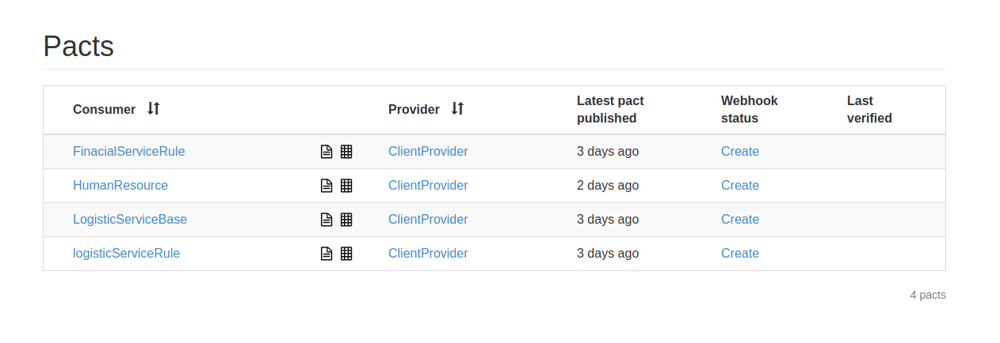
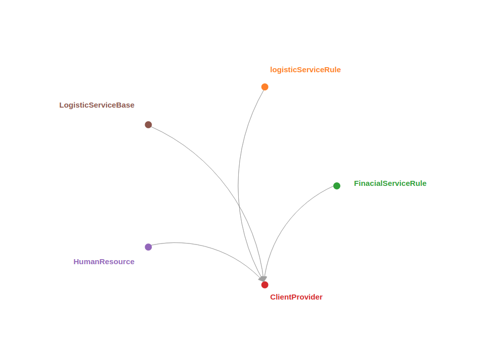

# PACT - Exemplos de uso

Nesses códigos vocês vão encontrar exemplos de uso do PACT como testes de contrato guiados pelo consumidor. Do lado dos consumidores da api usaremos PACT JVM Junit e no lado do provider Gradle task.

*Os serviços foram escritos em Java usando Spring e Node, e vão cobrir:*

* Exemplo de um provider e três consumidores.
* Produção do Pact em diferentes linguagens.
* Utilização do Pact Broker

**Tecnologias utilizadas**

* Gradle
* Spring boot
* Node
* JUnit
* Java
* Node
* Docker

**Entendendo a Aplicação:**

O exemplo simula uma arquitetura de microservices e cada serviço possui uma responsabilidade. 

* Produtor:
  *  client: é a nossa api (provedor) responsável por informações referente aos clientes do nosso negócio.
* Consumidor
  * financial: é responsável pelo setor financeiro da empresa
  * logistic: é responsável por entregas da empresa
  * humanresources: é responsável pelo gerenciamento dos funcionários da empresa

**Pact Broker**

No diretório infrastructure encontra-se o docker-compose.yml responsável por subir os containers do Pact Broker

Para executar:
```sh
docker-compose up -d
```

**Configurações Gradle**

* Produtor:
  
```
plugins {
	...

	id "au.com.dius.pact" version "4.0.3"
}

...

apply plugin: 'au.com.dius.pact'

...

pact {
    serviceProviders {
        ClientProvider {
            protocol = 'http'
            host = 'localhost'
            port = 8091
            path = '/'

            hasPactsFromPactBroker("http://localhost")
        }
    }
}
```

  * Adicionar e Aplicar o Plugin do Pact
  * pact { ... } : definições sobre o Boker:
    * serviceProviders: Define qual provider será verificado o contrato
    * hasPactsFromPactBroker: Path do btoker
    * protocol, host, port e path: informações do serviço provedor (api)


* Consumidor

```
plugins {
    ...

	id "au.com.dius.pact" version "4.0.3"
}

import java.net.URL


apply plugin: 'au.com.dius.pact'

dependencies {
    
    ...
	
    testImplementation("au.com.dius:pact-jvm-consumer-junit:4.0.3")
    testImplementation("au.com.dius:pact-jvm-consumer-java8:4.0.3")
}

test {
    systemProperties['pact.rootDir'] = "$rootDir/Pacts/Finacial"
} 

pact {
	    
    publish {
        pactDirectory = "$rootDir/Pacts/Finacial"
        pactBrokerUrl = 'http://localhost'
       // pactBrokerUsername = ''
       // pactBrokerPassword = ''
    }
}

```
* Adicionar e Aplicar o Plugin do Pact
* Definir as dependências necessárias.
* systemProperties['pact.rootDir']: define os consumidores geram os pactos localmente.
* pact { ... } : definições sobre o Boker:
  * pactDirectory: Local onde estão os pactos para serem publicados no broker
  * pactDirectory: Path do broker onde será publicado os pactos
  * pactBrokerUsername: Usuario para acessar o broker
  * pactBrokerPassword: Senha para acessar o broker

**Geração dos PACT**

* Projetos Java: Basta rodar na raiz do projeto
```
./gradlew clean test
```
* Projeto Node: Basta rodar na raiz do projeto
```
npm install

npm run test
```
**Publicar os PACT**

* Projetos Java: Basta rodar na raiz do projeto
```
./gradlew pactPublish
```
* Projeto Node: Basta rodar na raiz do projeto
```
npm run publish:pact
```

**Verificando o PACT**
Na raiz do provider (api client) rodar o comando
```
./gradlew pactVerify
```




**Fontes**
* [Pact](https://docs.pact.io/)
* [Pact-jvm](https://github.com/DiUS/pact-jvm)

